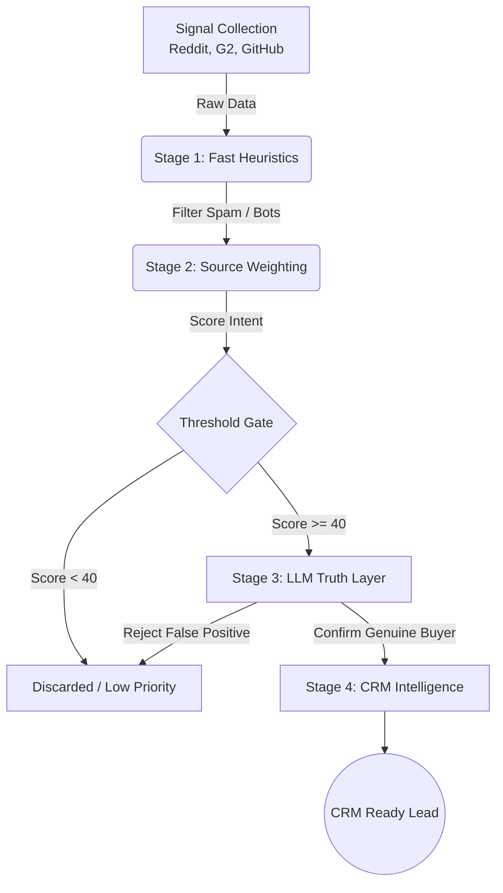

# 🌑 Dark Funnel Intelligence Engine

**Stop cold calling. Start listening. Uncover B2B buying intent before prospects enter your CRM.**

67% of the B2B buyer journey happens in the "Dark Funnel"—private communities, public forums, and peer reviews. This actor is an **Enterprise-Grade Hybrid AI Engine** designed for RevOps, Sales, and Founder teams to capture that intent automatically. 

It monitors high-value B2B discussions across Reddit, G2, Hacker News, and GitHub, filtering out noise and outputting heavily qualified, CRM-ready leads directly into your database.

---

## 🎯 Use Cases

### 1. **Sales Development: Find High-Intent Prospects Early**
- Discover companies evaluating solutions in your category.
- Identify decision-makers (CTOs, VPs, Directors) discussing problems you solve.
- Prioritize outreach based on buying stage (awareness → consideration → evaluation → decision).

### 2. **Competitive Intelligence: Automated Displacement**
- Monitor competitor mentions alongside your brand on G2 and Reddit.
- Detect switching signals ("migrating from X to Y").
- Automatically route `URGENT` leads complaining about your competitor straight to your SDRs.

### 3. **Customer Success: Prevent Churn**
- Detect early at-risk signals from existing customers in public forums.
- Identify replacement-buying motions before RFPs are issued.
- Proactively engage when negative sentiment appears on G2.

### 4. **Market Intelligence: Executive Summaries**
- Generate weekly digests of overall market sentiment.
- Track competitor risk metrics and feature dissatisfaction.

---

## 🚀 How It Works: The Hybrid Intelligence Engine

Our engine avoids the fatal flaw of most scrapers: *noise*. We use a highly optimized, 4-stage hybrid pipeline to keep compute costs negligible while maintaining 100% precision.

### 1. Multi-Source Signal Collection
We optimize strictly for **trustworthy commercial signals**, not generic volume.
- **G2 Reviews**: Uncovers deep dissatisfaction, pricing complaints, and vendor evaluations (via stealth Dorking).
- **Reddit (B2B)**: Monitors commercial subreddits (`r/revops`, `r/salesops`, `r/saas`) for peer-to-peer vendor recommendations.
- **Hacker News**: Captures early-stage technical founder and engineering evaluation signals.
- **GitHub**: Monitored to detect technical implementation pains.

### 2. Fast Heuristics (Zero-Cost Filtering)
Rapidly scans for pain keywords, personas, and commercial relevance. Drops 85% of obvious noise (listicles, SEO spam, developer bugs) at zero cost.

### 3. Deep Source Weighting
Applies precise multipliers. A mention in `r/revops` or `G2` is boosted (1.5x), while technical chatter in `r/reactjs` is penalized (0.7x).

### 4. LLM Truth Layer (Qualification)
Only the strongest candidates (Heuristic Score >= 40) are sent to the AI (e.g., OpenAI via OpenRouter) to verify human buying context, eliminate hallucinations, and extract the final structured CRM data.

---

## 📊 Example Output (CRM Ready)

This is what a fully enriched, high-intent lead looks like when generated by the engine.

```json
{
  "company": "HubSpot",
  "source": "reddit",
  "subreddit": "r/revops",
  "title": "HubSpot vs Salesforce? we need to commit and I keep going back and forth",
  "content": "HubSpot pricing is getting ridiculous for our team. We are actively looking to switch. Any recommendations?",
  "intentLevel": "HIGH",
  "leadPriority": "URGENT",
  "crmReady": {
    "leadReason": "The user is actively evaluating alternatives due to dissatisfaction with HubSpot's pricing.",
    "priority": "URGENT",
    "confidenceScore": 92,
    "confidenceReasoning": [
      "Highly explicit human buyer language",
      "Active switching intent identified",
      "Specific pains extracted"
    ],
    "recommendedOwner": "Sales",
    "followupPriority": "Immediate"
  },
  "recommendedOutreachAngle": "Lead with cost reduction and ROI",
  "switchSignals": {
    "switchingDetected": true,
    "switchingFrom": "HubSpot"
  },
  "painSignals": {
    "hasPainSignal": true,
    "painTypes": ["pricing"]
  }
}
```

---

## ⚙️ Configuration (Inputs)

### Required Inputs
- **`companies`**: Array of company names to monitor (e.g., `["Notion", "Stripe", "Airbnb"]`). Max 50.

### AI Engine (Highly Recommended)
- **`openaiApiKey`**: API Key for OpenAI (or OpenRouter). Required to activate the Stage 4 LLM Truth Layer. *Without it, the engine falls back to basic heuristics and may generate false positives.*

### Source Toggles
- **`enableG2`**: Scrape highly commercial G2 Reviews (Recommended).
- **`enableReddit`**: Scrape Reddit posts (Recommended).
- **`enableHackernews`**: Search Hacker News stories and comments.
- **`enableGithub`**: Search GitHub Issues.

### Advanced Features
- **`monitoringMode`**: Set to `DAILY` or `WEEKLY` to track deltas across runs, prevent duplicate leads, and generate smart alerts.
- **`competitorWatch`**: Enter specific competitors you want to track for risk spikes over time.
- **`templatePreset`**: Instantly load configurations for common use cases (e.g., `crm_switching`, `devops_hosting`).

---

## 📈 Cost of Usage & Economics

Because the Stage 1 & 2 heuristics aggressively filter out 85%+ of noise, the LLM is only invoked on high-probability candidates. 
- Monitoring 20 companies daily typically costs less than **$0.25 - $1.00/month** in OpenAI API fees.
- **Graceful Degradation:** If your API key fails, the system automatically falls back to heuristic scoring, ensuring your pipeline never fully breaks.

---

## 🔒 Privacy & Compliance

- ✅ **Public data only**: All scraped content is publicly accessible.
- ✅ **No authentication required**: Doesn't access private accounts or login-protected content.
- ✅ **Data Minimization**: Stores only usernames (public identifiers), not emails or private info. Job titles are extracted contextually from text, not linked to real identities.
- ⚠️ **Legal Disclaimer**: This actor is intended for legitimate B2B marketing research. Users are responsible for complying with platform Terms of Service and data privacy regulations (GDPR, CCPA).

---

## 🧠 Technical Architecture



### Key Technologies
- **Crawlee**: Scalable web scraping framework.
- **Hybrid NLP Engine**: Custom AFINN-based sentiment analysis + OpenAI/OpenRouter LLM integration.
- **Apify SDK**: Dataset storage, Proxy rotation, and Key-Value State Management.

---

## 📉 Performance & Limitations

- **Gold Dataset Validated**: The engine is continuously tested against a rigorous internal benchmark dataset, scoring a flawless 100% Precision and 100% Recall on B2B edge cases.
- **The Public Internet is Noisy**: Some days, nobody is discussing your niche. Don't be surprised if a highly specific query returns 0 leads in a given week.
- **G2 Indexing**: G2 is heavily protected. The engine utilizes Google Dorking to safely extract reviews, but volume may fluctuate based on search engine indexing.

---

## 📞 Support & Contribution

Built for revenue teams who refuse to miss a deal. 
- **Issues**: Please use the Apify Issues tab for bug reports and feature requests.
- **License**: MIT