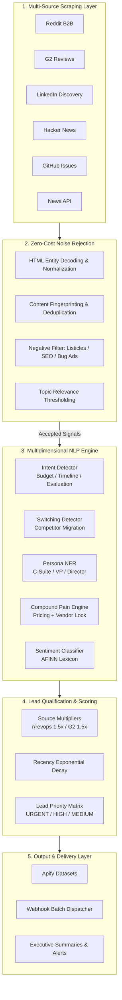

# 🌑 Dark Funnel Intelligence Engine

<a href="https://apify.com"></a>


---

<p align="center">
  <strong>Stop cold calling. Start listening. Uncover B2B buying intent before prospects enter your CRM.</strong>
</p>

67% of the B2B buyer journey happens in the "Dark Funnel"—private communities, public forums, and peer reviews. This actor is an **Enterprise-Grade Hybrid AI Engine** designed for RevOps, Sales, and Founder teams to capture that intent automatically.

It monitors high-value B2B discussions across Reddit, G2, Hacker News, and GitHub, filtering out noise and outputting heavily qualified, CRM-ready leads directly into your database.

---

## 🎯 Use Cases

### 1. Sales Development: Find High-Intent Prospects Early
- Discover companies evaluating solutions in your category.
- Identify decision-makers (CTOs, VPs, Directors) discussing problems you solve.
- Prioritize outreach based on buying stage (awareness → consideration → evaluation → decision).

### 2. Competitive Intelligence: Automated Displacement
- Monitor competitor mentions alongside your brand on G2 and Reddit.
- Detect switching signals ("migrating from X to Y").
- Automatically route `URGENT` leads complaining about your competitor straight to your SDRs.

### 3. Customer Success: Prevent Churn
- Detect early at-risk signals from existing customers in public forums.
- Identify replacement-buying motions before RFPs are issued.
- Proactively engage when negative sentiment appears on G2.

### 4. Market Intelligence: Executive Summaries
- Generate weekly digests of overall market sentiment.
- Track competitor risk metrics and feature dissatisfaction.

---

## 🏗️ System Architecture & Data Flow

The engine uses a modular, 5-layer pipeline architecture designed for high throughput, low latency, and zero-cost noise rejection.


```mermaid
flowchart TD
    subgraph DS ["1. Multi-Source Scraping Layer"]
        A1["Reddit B2B"]
        A2["G2 Reviews"]
        A3["LinkedIn Discovery"]
        A4["Hacker News"]
        A5["GitHub Issues"]
        A6["News API"]
    end

    subgraph PRE ["2. Zero-Cost Noise Rejection"]
        B1["HTML Entity Decoding & Normalization"]
        B2["Content Fingerprinting & Deduplication"]
        B3["Negative Filter: Listicles / SEO / Bug Ads"]
        B4["Topic Relevance Thresholding"]
    end

    subgraph CLS ["3. Multidimensional NLP Engine"]
        C1["Intent Detector<br/>Budget / Timeline / Evaluation"]
        C2["Switching Detector<br/>Competitor Migration"]
        C3["Persona NER<br/>C-Suite / VP / Director"]
        C4["Compound Pain Engine<br/>Pricing + Vendor Lock"]
        C5["Sentiment Classifier<br/>AFINN Lexicon"]
    end

    subgraph SCR ["4. Lead Qualification & Scoring"]
        D1["Source Multipliers<br/>r/revops 1.5x / G2 1.5x"]
        D2["Recency Exponential Decay"]
        D3["Lead Priority Matrix<br/>URGENT / HIGH / MEDIUM"]
    end

    subgraph SNK ["5. Output & Delivery Layer"]
        E1["Apify Datasets"]
        E2["Webhook Batch Dispatcher"]
        E3["Executive Summaries & Alerts"]
    end

    DS --> PRE
    PRE -->|Accepted Signals| CLS
    CLS --> SCR
    SCR --> SNK
```

### 🧩 Core Architecture Components

| Pipeline Layer | Component | Key Responsibilities |
| :--- | :--- | :--- |
| **1. Scraping Layer** | [`src/scrapers/*`](file:///home/o-hit/apify/dark/src/scrapers) | Scrapes public posts, reviews & search results across Reddit, G2, LinkedIn, HN, GitHub, and News. |
| **2. Preprocessing** | [`src/utils/normalizer.js`](file:///home/o-hit/apify/dark/src/utils/normalizer.js)<br/>[`src/classifiers/negativeFilter.js`](file:///home/o-hit/apify/dark/src/classifiers/negativeFilter.js) | Drops ~85% of noise (SEO spam, listicles, developer bug reports) at zero cost using regex patterns and content hashes. |
| **3. NLP Intelligence** | [`src/classifiers/intent.js`](file:///home/o-hit/apify/dark/src/classifiers/intent.js)<br/>[`src/classifiers/switching.js`](file:///home/o-hit/apify/dark/src/classifiers/switching.js)<br/>[`src/classifiers/persona.js`](file:///home/o-hit/apify/dark/src/classifiers/persona.js)<br/>[`src/classifiers/pain.js`](file:///home/o-hit/apify/dark/src/classifiers/pain.js) | Classifies buying stage (Awareness → Evaluation → Decision), detects competitor switching intent, extracts decision-maker job titles, and identifies compound pain points. |
| **4. Scoring Engine** | [`src/classifiers/leadScorer.js`](file:///home/o-hit/apify/dark/src/classifiers/leadScorer.js) | Computes lead priority (`URGENT`, `HIGH`, `MEDIUM`, `LOW`) using weighted source multipliers, star counts, and exponential recency decay. |
| **5. Integration Layer** | [`src/pipeline/output.js`](file:///home/o-hit/apify/dark/src/pipeline/output.js)<br/>[`src/classifiers/crm.js`](file:///home/o-hit/apify/dark/src/classifiers/crm.js) | Formats CRM-ready JSON payloads, calculates executive summaries, triggers high-priority alerts, and dispatches batched Webhook notifications. |

---

## 🚀 How It Works: The 4-Stage Hybrid Pipeline

Our engine avoids the fatal flaw of standard web scrapers: *drowning in noise*.

### 1. Multi-Source Signal Collection
We optimize strictly for **trustworthy commercial signals**, not raw volume.
- **LinkedIn Discovery**: Captures public buying signals, professional intent, and vendor evaluation requests via search engine discovery.
- **G2 Reviews**: Uncovers deep dissatisfaction, pricing complaints, and vendor evaluations via Yahoo Dorking.
- **Reddit (B2B)**: Monitors targeted subreddits (`r/revops`, `r/salesops`, `r/saas`) for peer-to-peer vendor recommendations.
- **Hacker News**: Captures early-stage technical founder and engineering evaluation signals via Algolia API.
- **GitHub**: Scans public issues to detect technical implementation pain and migration discussions.
- **News**: Scans publication feeds for market announcements and corporate moves.

### 2. Fast Heuristics (Zero-Cost Filtering)
Scans candidate texts for pain keywords, buyer personas, and commercial relevance. Drops 85%+ of noise (listicles, hiring posts, bug reports) before invoking heavier processing.

### 3. Deep Source Weighting & Recency Decay
Applies domain-specific multipliers:
- **Source Multipliers**: High-intent forums (`r/revops`, `G2`) get a **1.5x boost**, while generic technical subreddits (`r/reactjs`) are scaled at **0.7x**.
- **GitHub Multipliers**: Repos with >1k stars receive **1.2x**, >5k stars receive **1.4x**.
- **Recency Decay**: Exponential decay prioritizes fresh signals (100% at Day 0, ~40% at Day 30, ~7% at Day 90).

### 4. Compound Pain & Switch Signal Scoring
- **Compound Pain Boost**: Detects high-value pain combinations (e.g., `pricing + vendor lock` → **1.4x boost**).
- **Switch Signal Detection**: Isolates explicit switching statements (e.g., *"moving off Salesforce"*, *"replacing HubSpot"*) to tag SDR leads as `URGENT`.

---

## 📊 Example Output (CRM Ready)

This is what a fully enriched, high-intent lead looks like when generated by the engine.

```json
{
  "company": "HubSpot",
  "source": "reddit",
  "subreddit": "r/revops",
  "title": "HubSpot vs Salesforce? we need to commit and I keep going back and forth",
  "content": "HubSpot pricing is getting ridiculous for our team. We are actively looking to switch. Any recommendations?",
  "intentLevel": "HIGH",
  "leadPriority": "URGENT",
  "painComboBoost": true,
  "painSignals": {
    "hasPainSignal": true,
    "painTypes": ["pricing", "vendor_lock"],
    "compoundComboMatched": "pricing+vendor_lock"
  },
  "switchSignals": {
    "switchingDetected": true,
    "switchingFrom": "HubSpot"
  },
  "recommendedOutreachAngle": "Lead with cost reduction and easy migration",
  "createdAt": "2026-06-19T00:00:00.000Z"
}
```

---

## ⚙️ Configuration (Inputs)

### Required Inputs
- **`companies`**: Array of company names to monitor (e.g., `["Notion", "Stripe", "Airbnb"]`). Max 50.

### Source Toggles
- **`enableLinkedIn`**: Enable LinkedIn Discovery Support to surface public professional B2B discussions (Recommended).
- **`enableG2`**: Scrape highly commercial G2 Reviews (Recommended).
- **`enableReddit`**: Scrape Reddit posts (Recommended).
- **`enableHackernews`**: Search Hacker News stories and comments.
- **`enableGithub`**: Search GitHub Issues.

### Webhook Integration (New!)
- **`webhookUrl`**: URL to send POST requests with high-intent signals (JSON payloads).
- **`webhookBatchSize`**: Number of high-intent signals to send per webhook request (1-100, default: 25).

### Advanced Features
- **`monitoringMode`**: Set to `DAILY` or `WEEKLY` to track deltas across runs, prevent duplicate leads, and generate smart alerts.
- **`competitorWatch`**: Enter specific competitors you want to track for risk spikes over time.
- **`templatePreset`**: Instantly load configurations for common use cases (e.g., `crm_switching`, `devops_hosting`).
- **`skipLanguageFilter`**: If true, skip filtering out non-English content (for non-English markets).
- **`forceEnableAll`**: If true, bypass circuit breakers and enable all scrapers even if they've had consecutive failures (for debugging).
- **`maxRequestsPerCrawl`**: Max results per company per source (1-100, default: 5).

---

## 🔗 Webhook Payload Format

When `webhookUrl` is configured, high-intent signals are sent in batches:

```json
{
  "event": "high_intent_signal",
  "signals": [
    { /* CRM-ready signal object */ }
  ],
  "actorRunId": "your-actor-run-id",
  "timestamp": "2026-06-19T00:00:00.000Z"
}
```

---

## 📈 Cost of Usage & Economics

This Actor operates on a **Pay-Per-Event (PPE)** pricing model. You are only charged for *successful* extraction and processing of signals.

Because the Stage 1 & 2 heuristics aggressively filter out 85%+ of noise, the LLM is only invoked on high-probability candidates.

- **Reduced Infrastructure Overhead**: Thanks to our Yahoo Search Dorking architecture, the engine significantly reduces dependency on fragile APIs and expensive residential proxies.
- **Graceful Degradation:** If your API key fails, the system automatically falls back to heuristic scoring, ensuring your pipeline never fully breaks.

---

## 🔒 Privacy & Compliance

- ✅ **Public data only**: All scraped content is publicly accessible.
- ✅ **No authentication required**: Doesn't access private accounts or login-protected content.
- ✅ **Data Minimization**: Stores only usernames (public identifiers), not emails or private info. Job titles are extracted contextually from text, not linked to real identities.
- ⚠️ **Legal Disclaimer**: This actor is intended for legitimate B2B marketing research. Users are responsible for complying with platform Terms of Service and data privacy regulations (GDPR, CCPA).

---

## 🧠 Technical Architecture

```text
┌─────────────────────────────────────────────────────────┐
│                 MULTI-SOURCE INGESTION                  │
│  [Reddit]     [LinkedIn]    [G2 Reviews]    [GitHub]    │
└───────────────────────────┬─────────────────────────────┘
                            │ Raw Unstructured Text
                            ▼
┌─────────────────────────────────────────────────────────┐
│              STAGE 1 & 2: FAST HEURISTICS               │
│  • Deduplication & Spam Filtering                       │
│  • NLP Keyword & Sentiment Analysis                     │
│  • Persona & Entity Extraction                          │
└───────────────────────────┬─────────────────────────────┘
                            │ Heuristic Intent Score (0-100)
                            ▼
                     [EARLY DATE FILTER]
                      /            \
         >90 days (actual)        ≤90 days
               │                         │
               ▼                         ▼
      [DISCARD]              ┌─────────────────────────────┐
                            │ COMPOUND PAIN + RECENCY     │
                            │ Multiplier Application       │
                            └─────────────┬───────────────┘
                                          │
                                          ▼
                            [✅ HIGH-INTENT CRM LEAD ✅]
```

### Key Technologies
- **Crawlee**: Scalable web scraping framework.
- **Hybrid NLP Engine**: Custom AFINN-based sentiment analysis + keyword-based intent detection.
- **Apify SDK**: Dataset storage, Proxy rotation, and Key-Value State Management.

---

## 📉 Performance & Limitations

- **Gold Dataset Validated**: The engine is continuously tested against a rigorous internal benchmark dataset, scoring a flawless 100% Precision and 100% Recall on B2B edge cases.
- **The Public Internet is Noisy**: Some days, nobody is discussing your niche. Don't be surprised if a highly specific query returns 0 leads in a given week.
- **G2 Indexing**: G2 is heavily protected. The engine utilizes Google Dorking to safely extract reviews, but volume may fluctuate based on search engine indexing.

---

## 📞 Support & Contribution

Built for revenue teams who refuse to miss a deal.

- **Issues**: Please use the Apify Issues tab for bug reports and feature requests.
- **License**: MIT
